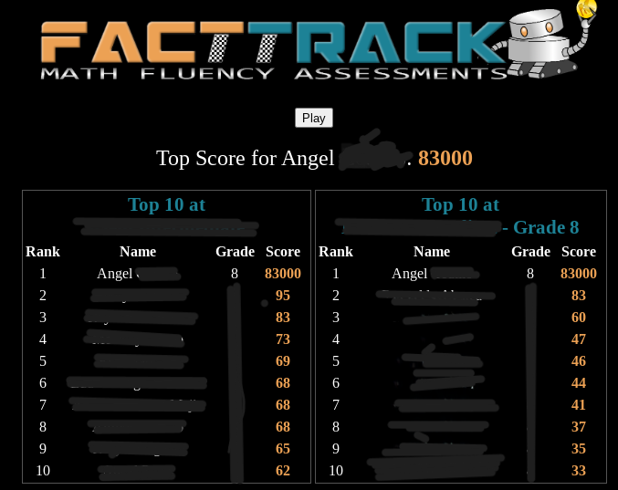

Are you curious about how I achieved an impressive score of 85k on the FactTrack leaderboard? In this blog post, I will explain the method I used. However, I want to make it clear that I don't endorse or encourage the usage of this exploit. My intention is to share my experience and raise awareness of the potential vulnerabilities in the game.


> Image of [facttrack website](https://facttrack.kleinisd.net/game/game.php)


Before we dive into the details, I want to emphasize that exploiting games for personal gain is unethical. It's important to play games fair and square, respecting the efforts of developers and other players.

Now, let's discuss the steps involved in achieving a high score on FactTrack.

**Required Firefox or any browser with developer tools enabled**

Open the FactTrack Game in your preferred browser. For the purpose of this example, I'll be using Firefox.

Once the FactTrack game is open, access the browser's Developer Tools. In Firefox, you can do this by right-clicking anywhere on the page and selecting "Inspect Element" or pressing Ctrl + Shift + I.

Inside the Developer Tools panel, navigate to the Console tab. This is where we will enter our commands to exploit the game.

The first command you need to enter is:

```js
score = [your chosen score]
```
Replace [your chosen score] with the score you want to achieve. For example, if you want a score of 100000, you would enter:

```js
score = 100000
```

After entering the command, press Enter to replace the default score of 0 with your chosen score.

The next command you need to enter in the Developer Tools Console is:

```js
SubmitScore();
```

This command submits your custom score to the server. The underlying implementation of the SubmitScore() function is as follows:

```js
function SubmitScore() {
    if (usertype == "student") {
        let xhr = new XMLHttpRequest();
        let url = "game_be.php";
        var params = "studentid=000000&score=" + score;
        xhr.open("POST", url, true);
        xhr.setRequestHeader('Content-type', 'application/x-www-form-urlencoded');
        xhr.onreadystatechange = function () {
            if (xhr.readyState === 4 && xhr.status === 200) {
	    		window.location.reload(); 
            }};
        xhr.send(params);
    } else {
        window.location.reload(); 
    }
}
```

After executing the SubmitScore() command, you will see the score you entered reflected on the FactTrack page as your new score.

It's worth noting that I was able to exploit the game because the JavaScript code was not hidden or obfuscated. This made it easier to manipulate the score directly from the browser console.

I must reiterate that this exploit should not be used. We should all strive to engage in fair play and respect the integrity of the games we play. This blog post serves as a reminder of the importance of secure coding practices for developers and the need for active vulnerability testing to prevent such exploits.

Thank you for taking the time to read this blog post.